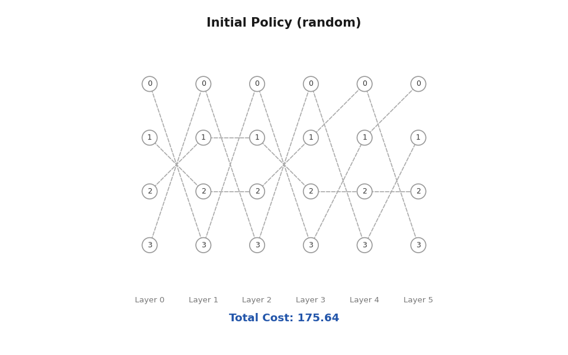

# On-Line Policy Iteration with Trajectory-Driven Policy Generation
Supplementary codes for 'On-Line Policy Iteration with Trajectory-Driven Policy Generation'

## Multidimensional Assignment (MDA) Problem 

Implementation of On-Line PI to MDA: 
