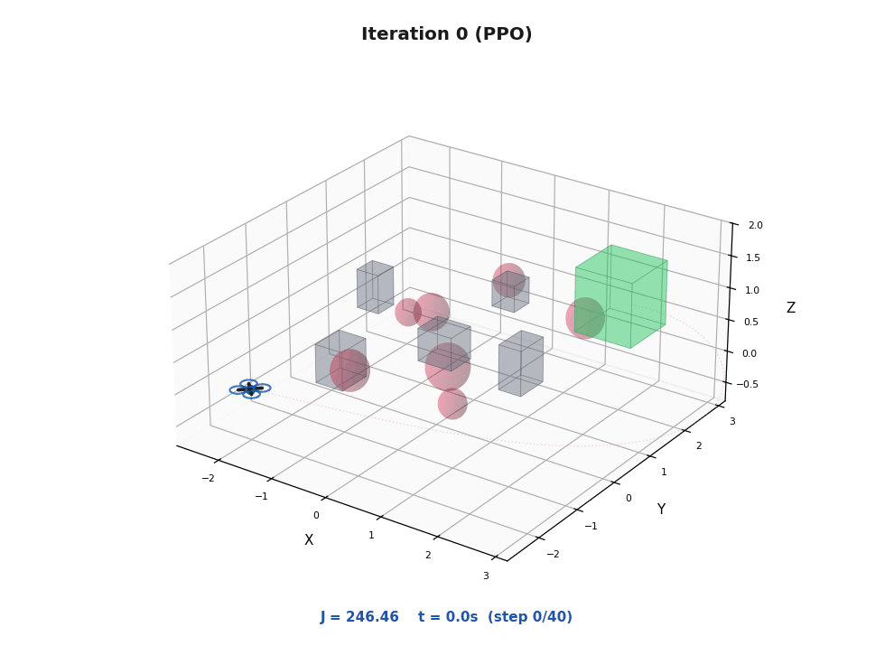

# On-Line Policy Iteration with Trajectory-Driven Policy Generation
Supplementary codes for 'On-Line Policy Iteration with Trajectory-Driven Policy Generation'

## Multidimensional Assignment (MDA) Problem 

On-line PI applied to MDA. Starting with a randomly generated solution, on-line PI updates the arcs between two frames at each stage. After one iteration, new assignment is obtained.

## Path Planning for a Drone 

On-line PI applied to plan a path for a drone. Starting with a path computed via proximal policy optimization, on-line PI converges after 4 iterations. The animation here shown the trajectories under the initial policy, and the policies computed after 4th and 8th iterations.
